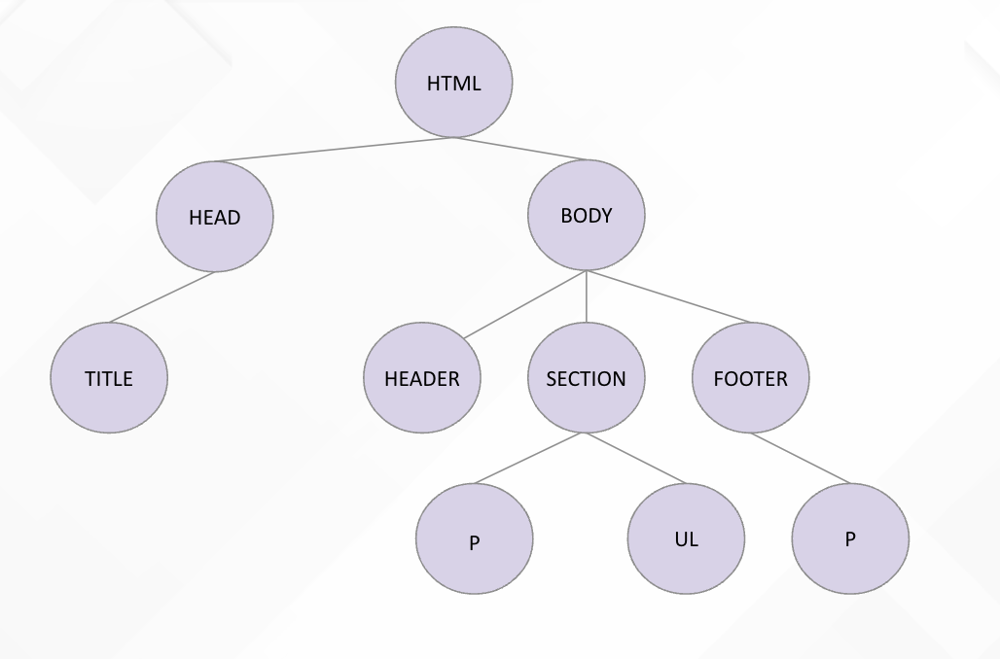

> [DIAPOSITIVAS](S2-recursos/introduccion.pdf)

---

Bienvenidos a una nueva sesión del prework, a lo largo de esta sesión vamos ver:

- Una primera introducción a HTML
- La estructura de un documento HTML y las etiquetas más importantes
- Haremos nuestra primera web

## ¿QUÉ ES HTML?

- Es el lenguaje estándar para la creación de cualquier página web
- Es un lenguaje de marcado, a partir de una estructura de etiquetas indica al navegador que contenido mostrar y como mostrarlo
- Utilizaremos etiquetas que nos indicarán que tipo de información mostrar (párrafos, tablas, títulos…)

## ESTRUCTURA ÁRBOL DE NODOS

HTML trabaja mediante una estructura de árbol de nodos. Tenemos un nudo raíz del cual se descuelgan diferentes nodos. De esta manera estos nodos pueden también ser padres de los siguientes y así sucesivamente.

Por ejemplo, vamos a verlo con la siguiente estructura de HTML (sin fijarnos en las etiquetas todavía):

```html
<!DOCTYPE html>
<html>
<head>
    <title>The Valley - Árbol de nodos</title>
</head>
<body>
    <header>
        <h1>Título de la página</h1>
        <h2>Subtítulo de la página</h2>
    </header>
    <section>
        <p>Párrafo de ejemplo</p>
        <ul>
            <li>Elemento de la lista 1</li>
            <li>Elemento de la lista 2</li>
            <li>Elemento de la lista 3</li>
        </ul>
    </section>
    <footer>
        <p>Pie de página</p>
    </footer>
</body>
</html>
```

Así sería la estructura de árbol de este código:



## ETIQUETAS

Una etiqueta es un trozo de código con el que vamos a indicar al explorador como mostrar cierto contenido. La estructura de la etiqueta sería tal que así:

<APERTURA ETIQUETA> CONTENIDO <CIERRE ETIQUETA>

```html
<p>Párrafo de ejemplo</p>
```

Estas etiquetas también pueden tener atributos como iremos viendo, por ejemplo un atributo de color que indica el color de la letra del párrafo:

```html
<p style="color:blue;">Párrafo de ejemplo</p>
```

  

## ESTRUCTURA HTML

Volviendo al ejemplo anterior:

```html
<!DOCTYPE html>
<html>
<head>
    <title>The Valley - Árbol de nodos</title>
</head>
<body>
    <header>
        <h1>Título de la página</h1>
        <h2>Subtítulo de la página</h2>
    </header>
    <section>
        <p>Párrafo de ejemplo</p>
        <ul>
            <li>Elemento de la lista 1</li>
            <li>Elemento de la lista 2</li>
            <li>Elemento de la lista 3</li>
        </ul>
    </section>
    <footer>
        <p>Pie de página</p>
    </footer>
</body>
</html>
```

 

Tenemos:

- Etiqueta 
```html
    <html> 
 ``` 
  que es la etiqueta raíz con la que se inicia cualquier fichero de HTML
- Etiqueta <head> contenido html que no es mostrado ( titulo, referencias a otros archivos, contenido seo….
- Etiqueta <body> donde metemos todo el contenido que queremos mostrar


```html
<html>
<head>
    CONTENIDO QUE NO SE MUESTRA
</head>
<body>
    CONTENIDO QUE QUEREMOS MOSTAR
</body>
</html>
```

¡Seguimos!
