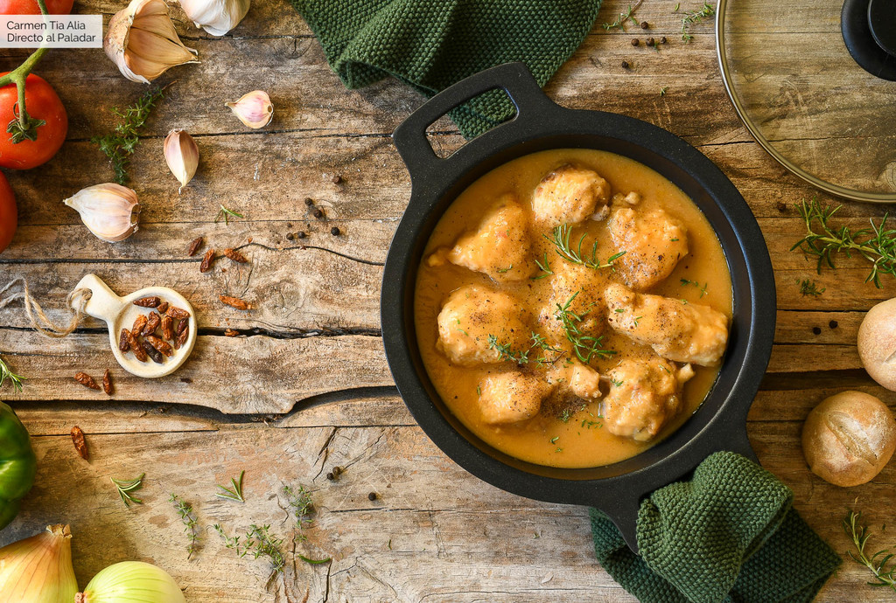

> [Enunciado](S2-recursos/tarea-receta.pdf)

> [Imagen receta](S2-recursos/img/pollo-pantoja.jpg)

---

¡Ahora os toca el turno a vosotros! Nos han pedido por favor que les montemos esta receta de Pollo a la Pantoja:

> [Enunciado](S2-recursos/tarea-receta.pdf)

Como veis, es una web que utiliza etiquetas muy similares a las que hemos usado en el ejercicio anterior.

Tips para llevar a cabo con éxito este ejercicio:

- Analizar la estructura previamente antes de escribir código.
    - ¿Qué puede ser el header?
    - ¿Cuántas secciones hay?
    - ¿Hay footer?
- Analizar qué elementos tengo en cada una de esos bloques
    - ¿Listas?
    - ¿Tablas?
    - ¿Enlaces? (Hay uno hacia la página de Mercadona)
- Trabajar bloque a bloque
    - Empieza por el header y sigue por el resto de secciones
- Atento a las negritas, cursivas…

Os dejamos también los recursos necesarios para poder desarrollarla:

- La imagen del Pollo a la Pantoja
    
   

- Textos de la web:
    
    Receta fácil de pollo a la Pantoja
    
    Así se hace el plato más popular y sabroso del ya desaparecido restaurante de Isabel Pantoja.
    
    
    Hace años la cantante Isabel Pantoja abrió en Fuengirola, Málaga, el restaurante Cantora. Durante los años que estuvo operativo, el pollo Cantora o pollo a la pantoja fue su plato estrella. Y no es de extrañar, pues este pollo, sencillo de elaborar, es sublime.
    
    
    
    Ingredientes
    
    Para 4 personas
    
    1 Pollo entero troceado
    0,5 Cebolla
    0,5 Puerro
    4 Tomates pera
    3 Dientes de ajo
    0,5 Pimiento verde
    Tomillo fresco, romero y laurel
    300ml Caldo de pollo
    250ml Cerveza
    

    Preparación
    
    Limpiamos bien el pollo, retirando restos de plumas y suciedad.
    Secamos, salpimentamos y pasamos por harina
    Calentamos un poco de aceite de oliva en una cazuela amplia y freímos ligeramente
    Pelamos y picamos los dientes de ajo, la cebolla, el puerro y el pimiento verde
    Añadimos los tomates, pelados y troceados, y pochamos.
    Separamos el pollo de la salsa y trituramos esta última con una batidora de brazo
    
 
    Reviews
    
    Nombre	Review
    Teresa	¡Me encanta!
    Pepe	Lo hago todas las semanas

    @Isabel Pantoja copyright 202

